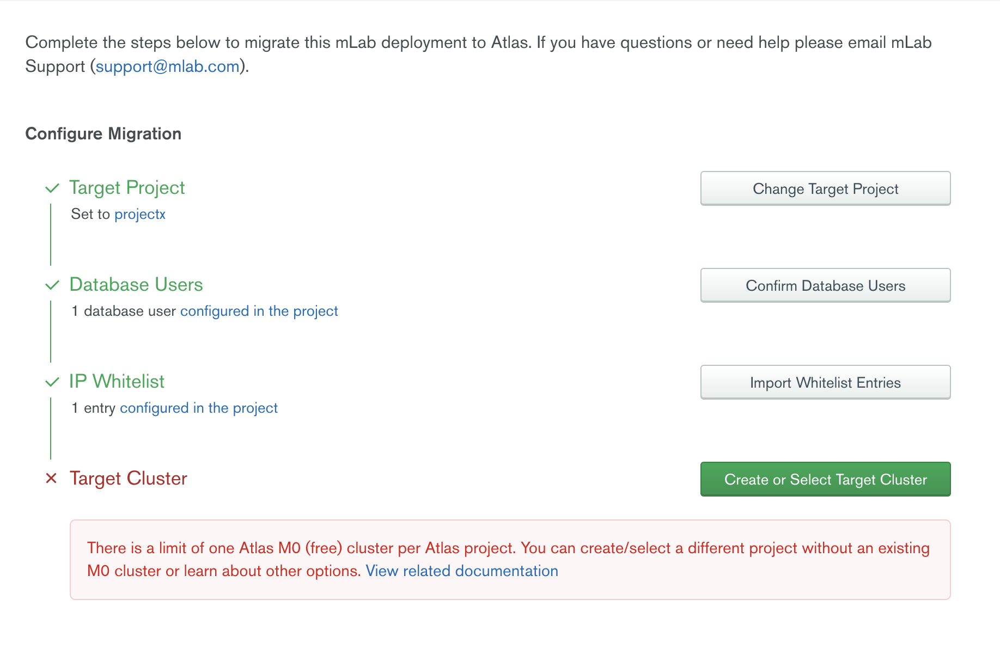
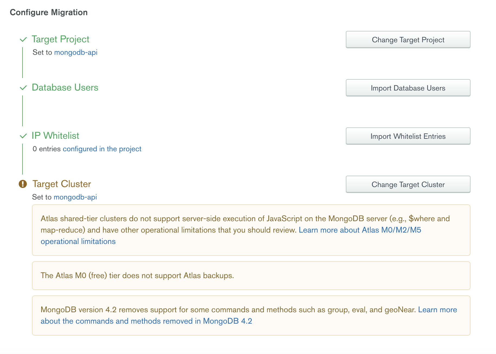
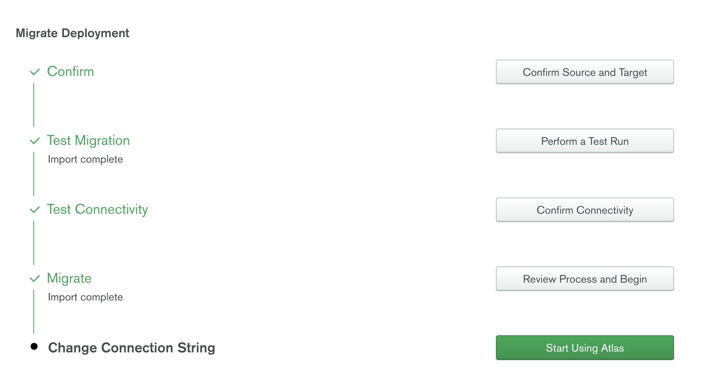

Since `mLab` was acquired by `MongoDB`, we have been forced to migrate our databases to `MongoDB Atlas`.

So... Here's an easy and brief tutorial to do so.

1. Create a [MongoDB Atlas account](https://mongodb.com/cloud/atlas)
   During the process create an `organization`, example: `MyOrganization`
1. Create a new `project`, example: `project1`. _Note:_ Clusters are stored in Atlas projects, each of which live underneath an Atlas organization.
1. On the top left, next to your organization name, `MyOrganization` **click on the the gears icon**
1. Click on `Connect to mLab`
1. Log into your `mLab account`
1. Click on `Authorize`
1. You will be redirected to your `MongoDB Atlas account` and you should be seeing your `mLab` deployments.
1. For each deployment, click on the `...` (under actions) and click on `Configure Migration`
1. Click on `Create or Select Target Project`
1. Select your project, `project1` and click on `Confirm Project and Continue`
1. On the `Import Database Users`, keep everything as it is and click on `Import Database Users and Continue`
1. On `Import Whitelist Entries` click on `Confirm and Continue`
1. On `Create or Select Target Cluster` you can select a previous cluster or, pick `Create most equivalent new cluster` (we are going to choose this option). Then, click on `Confirm Target and Continue`

_Note:_ If you have a free plan and you want to create a new cluster, you will need to create a `new project`, then go to `settings` (gears icon), select `mLab Account` tab and re-start for clicking on `...`. Click on `Configure Migration`.

I will assume this is your case, since it is just a little more complex.

14. Now, we need to go back to `Target Project`. So click on `Change Target Project` and select your new project name, example: `project2`. Then, `Confirm Project and Continue`.
1. Click on `Change Target Cluster` and select `Create most equivalent new cluster`. Then, click on `Confirm Target and Continue`.

Great job! We can start now with the **Migration**

16. Click on `Confirm Source and Target`. Then, `Continue and Continue`.
1. On the `Test Run` screen click on `Begin Test Run` (this is not mandatory, but highly advisable).
1. After the `Test Migration` is done, click on `Confirm Connectivity` and then, `Confirm and Continue`
1. On `Review Migration Process and Begin`, check the box `I understand that clicking "Begin Migration" will set the database user...` and click on `Begin Migration`.
1. Click on `Start Using Atlas`. Then, click on `I'm Done`.
1. Now, you can finish deleting your `mLab Deployment`. Check the box `I will confirm that my application is working as expected on my new Atlas cluster before deleting the source mLab database via mLab's UI.` and click on `Confirm and Close`.

Now, we are going to set **Network Access**

22. Go to your Project, example `project1`, then, under SECURITY click on `Network Access`
1. Click on `Add IP Address`
1. Click on `ALLOW ACCESS FROM ANYWHERE` (I have dummy data, in your case, probably, you will want to be more restrictive). Then, click on `Confirm` and wait until changes are _deployed_.

Now, we are going to set `Database Access`

25. Go to your Project, example `project1`, then, under SECURITY click on `Database Access`
1. Click on `Add New Database User`
1. I will use regular user/password pattern (in this case, select `password`).
1. Under `Password Authentication` type first the `username` and then the `password`
1. In my case, I will keep everything as default and click on `Add User`.
